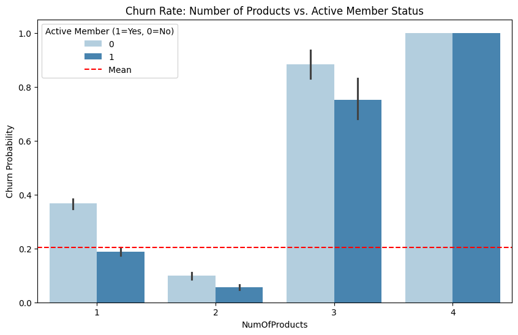
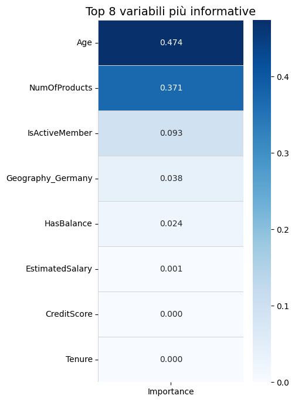

# Bank Customer Churn – Perché i clienti lasciano la banca?

Progetto universitario di analisi dei dati in Python. Mettendoci nei panni del management di una banca internazionale, abbiamo cercato di capire **quali clienti hanno la probabilità più alta di chiudere il conto e perché**, per proporre strategie di fidelizzazione mirate.

Abbiamo scelto un **albero decisionale** perché non ci interessava solo prevedere *se* un cliente se ne andrà, ma soprattutto *perché*: l'albero rende esplicite le soglie e le condizioni che portano all'abbandono.

## Dataset

- **10.000 clienti**, 17 variabili (`Bank_Churn.csv`), dataset benchmark pubblico del settore bancario, già anonimizzato
- Clienti in Francia, Germania e Spagna
- Variabile target: `Exited` (1 = ha lasciato la banca). Il **20,4%** dei clienti ha abbandonato, quindi le classi sono sbilanciate
- Altre variabili: età, saldo, numero di prodotti, attività del cliente, credit score, stipendio stimato, anzianità, tipo di carta, punteggio di soddisfazione

## Strumenti

Python · pandas · matplotlib · seaborn · scikit-learn · Google Colab

## Cosa abbiamo fatto

1. **Pulizia dei dati**: controllo di valori mancanti e duplicati, rimozione delle colonne identificative, eliminazione di 59 record con stipendio annuo anomalo (< 1.000 €), creazione della variabile `HasBalance` per distinguere i conti a saldo zero (36% dei clienti) da quelli con risparmi
2. **Analisi descrittiva**: distribuzioni delle variabili principali, matrice di correlazione e approfondimenti su età, saldo, attività e numero di prodotti in relazione all'abbandono
3. **Modello predittivo**: albero di classificazione, con scelta della profondità tramite 10-fold cross-validation e Grid Search (profondità 4 scelta per leggibilità, a fronte di una differenza di accuratezza trascurabile rispetto all'ottimo)
4. **Due scenari a confronto**: un modello base e un modello con `class_weight='balanced'` per gestire lo sbilanciamento delle classi

## Risultati principali

- **Numero di prodotti**: 2 prodotti è la condizione di massima fedeltà. Con 3 prodotti il tasso di abbandono supera il 75%, con 4 arriva al 100%
- **Età**: è la variabile più discriminante. Il modello separa i clienti a 42,5 anni; il segmento più a rischio è quello dei clienti **inattivi tra 50 e 67 anni**, con un tasso di abbandono di circa l'87%
- **Attività**: i clienti inattivi abbandonano molto più spesso, soprattutto dopo i 40 anni
- **Germania**: mostra un rischio di abbandono più alto rispetto a Francia e Spagna, anche tra i clienti giovani
- **Reddito, credit score e anzianità** hanno un impatto quasi nullo sull'abbandono

## Performance dei modelli

| Modello | Accuracy (test) | Precision | Recall |
|---|---|---|---|
| Albero base | 84,3% | 69% | 40% |
| Albero con `class_weight='balanced'` | 76,3% | 44,5% | **70%** |

In entrambi i casi il gap tra training e test è circa dell'1%, quindi i modelli non soffrono di overfitting.

Abbiamo scelto il **modello bilanciato**: il modello base, pur più accurato, non riconosceva 6 clienti a rischio su 10. Per una banca perdere un cliente costa molto più di un contatto in più con un cliente fedele, quindi abbiamo privilegiato la Recall, passando dal 40% al 70% dei clienti a rischio intercettati.

## Raccomandazioni per la banca

- **Stop all'over-selling**: non spingere oltre i 2 prodotti; per chi ne ha 3 o 4, proporre pacchetti che semplifichino la gestione
- **Attenzione ai 40 anni**: contattare in modo proattivo i clienti che si avvicinano alla fascia a rischio con una revisione delle condizioni
- **Riattivazione automatica**: quando un cliente over 40 diventa inattivo, far partire subito un contatto (email o app)
- **Indagine sul mercato tedesco**: capire se il problema in Germania dipende dalla concorrenza o dal servizio

## Come eseguire il notebook

Apri il notebook con il pulsante **Open in Colab** in alto. Il codice legge il CSV da Google Drive: per eseguirlo, carica `Bank_Churn.csv` nel tuo Drive e aggiorna il percorso nella cella di importazione.

